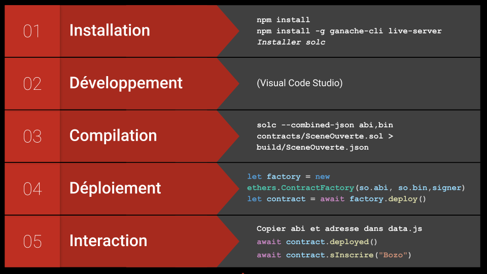

# Exercices dApps
Exercices and basic examples of decentralized applications (dApps) in French using Ethereum, HTML, JavaScript, ethers and IPFS. For a complete example in English, please have a look at [elemental dapp](https://github.com/Xalava/elemental-dapp).

## SceneOuverte
DApp simplifiée du contrat de scene ouverte:

#### Prérequis
- Installer [metamask](https://metamask.io/)
- Installer live-server, un serveur web local : `npm i -g live-server`
- Installer [ganache graphique](https://www.trufflesuite.com/ganache) ou `npm i -g ganache-cli`
- Lancer ganache. Sur la version graphique changer le port pour 8545
- Connecter metamask à ganache (réseau->localhost:8545)

ganache-cli et metamask sont déjà installés sur [cryptotux](https://cryptotux.org)

#### Version Simple
- Déployer le contrat via remix 
- Coller dans data.js l'adresse du contrat une fois déployé
- Lancer un serveur web dans le dossier (par exemple `live-server`)
- Installer et utiliser metamask pour intéragir

#### Version SceneOuverteDeploiement
Cette version offre un exemple complet avec le script de déploiement. 
- `npm install`
- installer solc (cf. documentation de solc)
- `npm start`

Cette dernière commande combine la compilation, le déploiement sur un noeud local et le lancement du serveur web. Pour plus de détails, voir le fichier package.json et l'image ci-dessous.

## ChargerImage
Exemple pour charger une image du systeme de fichier dans une page web

## Epinglage
Serveur d'épinglage IPFS